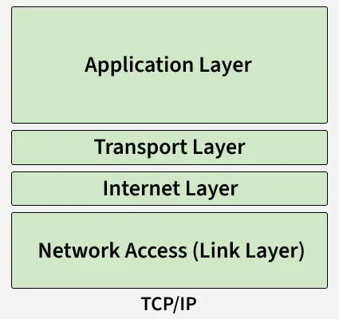

# Počítačové sítě

## Historie
["Brief" history of internet](https://www.internetsociety.org/internet/history-internet/brief-history-internet/)  
[wikipedie](https://en.wikipedia.org/wiki/History_of_the_Internet#1973%E2%80%931989:_Merging_the_networks_and_creating_the_Internet)
### Vznik a vývoj
1. **Výzkumný projekt agenturou ARPA** (**A**dvanced **R**esearch **P**rojects **A**gency)
    - **60. léta**
    - Propojit univerzity a výzkumná centra - (**WAN** - **W**ide **A**rea **N**etwork)
    - Vvytvořit odolnou síť, která by fungovala i při výpadku části infrastruktury
    - [Packet switching](#packet-switching)
    - 1969 - První funkční packetová síť
      - Uzly UCLA, SRI, UCSB, Utah
      - Používal NCP
2. **Přechod na internet**
    - **80. léta**
    - Zavedení [**TCP**](#tcp---transmission-control-protocol)
    - Postupné propojování více síťí (network of networks)
    - Rozvoj univerzitních a výzkumných sítí
3. **W**orld **W**ide **W**eb
    - **90. léta**
    - Vytvořeno v 1989 - **Tim Berners-Lee** (Sir Timothy John Berners-Lee 🤌🤌)
      - HTTP, HTML, URL
    - Masově použitelný internet
4. **Moderní internet**
    - Mobilní internet, cloud, sociální sítě
    - Streamování, 5G, IoT
    - Důraz na bezpečnost a šifrování (HTTP**S**), dostupnost (5G), škálovatelnost


Postupně se síť rozšiřovala i mimo akademický prostor
- V 90. letech se otevřela komerčnímu využití

A stala se globální komunikační infrastrukturou

### Technologie a protokoly

#### **Packet switching**
- Rozdělení dat na packety
- Každý packet může jít jinou cestou
- V destinaci se zase složí

### **TCP** - **T**ransmission **C**ontrol **P**rotocol
Zajišťuje bezpečný přenos informací
- pořadí dat, kontrola a oprava chyb
- **UDP** (**U**ser **D**atagram **P**rotocol) zařizuje rychlé spojení bez kontroly chyb

### **IP** - **I**nternet **P**rotocol
Zajišťuje směrování mezi sítěmi
- IPv4 se stal protokolem v roce 1983
  - V budoucnu nahrazen IPv6

---

## TCP/IP model
> Jak jsou data přenášena na internetu
- Praktičnější a jednodušší než **OSI**
- [Random video (actually useful)](https://youtu.be/XIgniNnM1wg?si=ZIl9cPGTuh6Bm4d1&t=173)
- [GeeksForGeeks](https://www.geeksforgeeks.org/computer-networks/tcp-ip-model/)

Zapouzdření dat - každá vrstva přidá vlastní hlavičku



### **Vrstvy**
1. **Application**: Bridge mezi nižšímy vrstvami a uživately (př. HTTP, FTP, DNS)
2. **Transport**: Zajišťuje spolehlivý přenos dat
    - Basically [TCP](#tcp---transmission-control-protocol) a UDP
3. **Internet**
    - Adresování: adresace IP
    - Routing: propočítání nejlepší cesty do cíle
    - Fragmentace a znovu-sestavení: větší packety se rozpadnou na menší pro lepší dopravu (sestaví se v cíli)
    - Protokoly: hlavně **IP** podpořené [**ICMP**](https://www.geeksforgeeks.org/computer-networks/internet-control-message-protocol-icmp/) a [**ARP**](https://www.geeksforgeeks.org/ethical-hacking/how-address-resolution-protocol-arp-works/)
4. **Network Access/Link**
    - Zajišťuje přenos dat mezi síťovím hardwarem (kabely, switche, ...)
    - Přístup k hw: posílá jednotlivé bity přes médium
    - MAC adresy: identifikuje zařízení podle MAC adres
    - Kontrola přístupu: řídí způsob, jakým několik zařízení přistupuje k jednomu fyzickému médiu


---

## IP adresy
- **Struktura**
    1. Síťová část: `192.168.10`
    2. Hostitelská část: `200`

### **Maska sítě** (subnet mask)
- Která část IP adresy patří síti a která zařízení?
- |IP|Maska|
  |--|-----|
  |`192.168.10.200`|`255.255.255.0`|
  |`11000000.10101000.00001010.11001000`|`11111111.11111111.11111111.00000000`|
  -> Síť je `192.168.10.0/24`
### **Síťová adresa**
- Bit **AND** mezi adresou a její maskou:
- |Stuff|Desítkově|Binárně|
  |-----|---------|-------|
  |IP|192.168.1.34|`11000000.10101000.00000001.00100010`|
  |Maska|255.255.255.0|`11111111.11111111.11111111.00000000`|
  |Síťová|192.168.1.0|`11000000.10101000.00000001.00000000`|

### **Broadcast adresa**
  - Výpočet: `sitova_adresa | (!mask)`

### IPv4 vs IPv6
**IPv4**: 32 bitů -> **~4.3 miliardy** adres -> **nedostatek**
- Běžně používá **NAT** pro zvýšení počtu adres
- 4 oktety (0..255) => `192.168.10.200/24`

**IPv6**: 128 bitů -> víc než **340 trilionů** adress -> mohlo by stačit :D
- Lepší podpora zabezpečení autoconfigu

- **CIDR** (**C**lassless **I**nter-**D**omain **R**outing) notace
  - `IP_adresa / počet_bitů_sítě` - `192.168.1.0/24`
    - Síť má `24` bitů
    - Host má `32-24` bitů


### Veřejná vs privátní IP adresa
- **Veřejná**: unikátní na celém internetu
  - Přiděluje ISP
- **Privátní**: osobní lokální adresa
  - Pouze v LAN

---

## Porty a protokoly
### Port
Port = identifikátor služby/aplikace na zařízení (číslo `0-65535`)

IP adresa určuje zařízení, port určuje službu
- `192.168.1.10:80` (web. http server na portu 80)

#### Známé porty (well-known ports) (0-1023)

|Port|Služba| Port | Služba|
|----|------|------|-------|
|20/21|`FTP`|80|`HTTP`|
|22|`SSH`|110| `POP3` (email)|
|23|`telnet`|143| `IMAP` (email)|
|25|`SMTP`|442|`HTTPS`|
|53|`DNS`|

### Protokoly

#### TCP (**T**ransmission **C**ontrol **P**rotocol)
- [TCP/UDP model](#tcp---transmission-control-protocol)

- Spolehlivý, kontroluje doručení dat
- Spolehlivé navázání spojení (3-way handshake)
- Řídí přenášení paketů
- Pomalejší ale bezpečnější přenos

Použití: HTTP, SSH, FTP, ...

#### UDP (**U**ser **D**atagram **P**rotocol)
- Rychlý
- Nezaručuje doručení paketů
- Nenavazuje spojení

Použití: DNS, online hry, streamování, ...


### Aplikační vrstvy
#### `HTTPS` (443 - TCP)
`HTTP` + TLS šifrování
- Bezpečná verze `HTTP`
- Používá certifikáty

#### `DNS` (53 - TCP/UDP) 
**D**omain **N**ame **S**ystem
- Překládá jména domén na adresy

#### `SSH` (22 - TCP)
Bezpečné a šifrováné vzdálené přihlášení

#### `FTP` (21 - TCP)
**F**ile **T**ransfer **P**rotocol
- Nahrazen SFTP kvůli bezpečnosti

---

## Routování

### Router
Propojuje různé sítě
- Přeposílá pakety mezi sítěmi
  - Nalézá cestu k cíli

1. Přujmutí paketu
2. Podívá se na cílovou adresu
3. Najde jí v routovací tabulce
4. Najde nejlepší cestu pro paket

### Routovací tabulka
Seznam pravidel, kam posílat pakety
- Vždycky vybere nejpřesnější shodu v tabulce

Zaznamy Obsahují:
- Cílovou síť
- Masku sítě
- Next hop (kterému routeru paket poslat)
- Výstupní rozhraní (ethernet port, ...)

### Statické routování

Nastaveno ručně adminem

Vhodné pro malé sítě

### Dynamické routování

Vyhledávání optimální cesty pomocí protokolu
- Routery si mezi sebou vyměňují informace
- Reakce na změny v síti

Vhodné pro větší sítě (WAN)

Protokoly:
- `RIP` - Cesta s nejméně hopy
- `OSPF` - Dijkstra algo
- `BGP` - mezi poskytovateli

### Default gateway

„Všechno, co neznám, pošli sem.“
- IP adresa routeru (`192.168.22.1`)
- V rout. tabulce se zapisuje se jako `0.0.0.0`

### Putování paketů
#### Lokální síť
- Komputor posílající data: 192.168.2.20
  - Cíl: 142.250.74.36
- Router:
  - Default gateway: 192.168.1.1
  - IP adresa: 85.160.12.34

#### Putování

1. Vytvoření paketu
    - Source IP: 192.168.2.20
    - Dest IP: 142.250.74.36

    IP není v síťi => pošle na default gateway
2. Lokální router
    Zapouzdřeno do ethernetového rámce
    - Source MAC: MAC zdroj. PC
    - Dest MAC: MAC routeru
3. NAT (**N**etwork **A**ddress **T**ranslation)
    Protože `192.168.x.y` jsou privátní adresy
    - Router změní:
      - Source (`192.168.2.20`) na Veřejnou IP routeru (`85.160.12.34`)
    - Dest IP zůstává
4. Putování internetem
    IP adresy se nemění  
    Každý router: upraví hlavičku ether. rámce
    - IP zůstávájí stejné po celou cestu (kromě NATu)
5. Příchod do destinace
    Server dostane:
    - Source IP: `85.160.12.34`
    - Dest IP: `142.250.74.36`
    A odpoví:
    - Source IP: `142.250.74.36`
    - Dest IP: `85.160.12.34`

---

## DNS (**D**omain **N**ame **S**ervice)

### Princip
Překlad jmen domén na IP adresy:
1. Lookup v lokálním cache
2. Pokud nenalezeno, dotaz jde na **rekurzivní DNS server** (ISP nebo veřejný)
3. DNS server vyhledá IP adresu nebo dotaz předá jinému DNS serveru
4. Server pošle IP adresu zpátky

### Hierarchie
1. **Root** servery
    - Neznají konkrétní adresy
    - Ukazují na TLD servery
2. **TLD** (**T**op-**L**evel **D**omain)
    - Spravují koncovky (`.cz`, `.com`, ..)
    - Koncovku `.cz` spravuje `CZ.NIC`
3. Autoritativní servery
    - Poskytují finální odpověď

Dotaz -> `Root` -> `TLD` -> `Autoritativní` -> odpověď


### Druhy záznamů

**`A`**: Doménu na `IPv4` adresu
- `google.com` -> `8.8.8.8`

**`AAAA`**: Doménu na `IPv6` adresu

**`CNAME`** (**C**anonical **NAME**)
- Alias domény: `www.google.com` -> `google.com`

**MX** (**M**ail e**X**change)
- Určuje poštovní server pro danou doménu
  - `...@example.com` je spravováno na doméně `mail.example.com`

**TXT**: Textové info
- SPF (ochrana proti spamům)
- DKIM (ověření emailu)
- Ověření vlastnictví domény (např. pro Google služby)


### Konfigurace

#### DNS resolver
Systémová komponenta, většinou `systemd-resolved`, `bind` nebo `dnsmasq`

**Funkce**: Překládá domény na žádost jiných programů
- Používá lokální cache: `/etc/hosts`, nebo odešle request na [DNS server](#hierarchie)

**Restart**: `systemctl restart systemd-resolved`

**Nastavení `systemd-resolved`**
- [Arch wiki](https://wiki.archlinux.org/title/Systemd-resolved)
- Conf. soubor: `/etc/systemd/resolved.conf`
  - nebo `/usr/lib/systemd/resolved.conf` 🤷‍♂️
Ukázka:
```ini
[Resolve]
DNS=8.8.8.8 1.1.1.1
FallbackDNS=9.9.9.9
Domains=local
```

**CMD**: `systemd-resolved google.com`

### Lokální DNS cache

Výhody:
- Rychlejší lookup
- Menší síťový provoz

Nevýhody:
- Nízká kapacita cache

### `/etc/hosts`
Ruční přiřazování IP adres doménám, přednost před resolverem
- část cache?
- See hosts(5)

```txt
127.0.0.1   localhost
192.168.1.10 server.local
```

### `/etc/resolv.conf`
Určuje, které DNS servery se mají používat
- Často automaticky generovaný, nebo je symlink

```txt
nameserver 127.0.0.53
options edns0 trust-ad
search skola.ssps.cz ssps.cz
```
`nameserver`: IP adresa DNS serveru

`search`: doména doplněná při zadání neúplného jména

`domain`: výchozí doména


