# 05. Analýza síťového provozu

# Metody zachytávání síťového provozu

## Port mirroring - SPAN (**S**witched **P**ort **AN**alyzer)

Funkce na switchi, kopíruje provoz z jednoho nebo více portů na jiný port, kde může být připojeno analyzační zařízení

Switch duplikuje pakety a posílá je na jiný port
- Linuxový server je může zachytávat a analyzovat

### Výhody
- Bez zásahu do kabeláže
- Jednoduché nastavení (na switchi)
- Možnost sledovat více portů najednou

### Nevýhody
- Může dojít ke ztrátě paketů při vysokém zatížení
- Závislé na schopnostech switche
- Ne vždy zachytí úplně vše (např. chyby na fyzické vrstvě)

## Network taping (odposlechy)
### Pasivní
Vložené zařízení mezi dvě jiná zařízení
- Kopíruje a posílá data dál, kopie jde do odposlouchávacího zařízení

#### **Výhody**
- Žádná ztráta paketů
- Nezjistitelné
- Neovlivňuje provoz

#### **Nevýhody**
- Nutnost fyzického zásahu do sítě
- Vyšší cena

### Aktivní

Aktivně zpracovává a přeposílá provoz

Funguje podobně jako bridge/switch
- Kopíruje provoz a může ho i filtrovat nebo upravovat

#### **Výhody**
- Pokročilé funkce (filtrace, agregace)
- Možnost práce s více linkami

#### **Nevýhody**
- Při výpadku může přerušit komunikaci
- Může ovlivnit latenci

### Promiskuitní režim síťové karty

Karta přijímá všechny pakety, nejen ty určené pro její MAC adresu
- Spuštěno pomocí `tcpdump`, `wireshark`, `ip link set eth0 promisc on`

---

# `tcpdump`

[haxagon](https://haxagon.xyz/challenge/642e97e75ae25f45b10318f6#tcpdump)

## Switche
- `-c <n>`: Zachytí **`n` paketů** a pak se vypne
- `-s <size>`: **Maximální velikost** paketů v bajtech
- `-n`: **Vypne DNS** resolvování
  - `-nn`: **Nepřekládá** názvy portů (`22` != ssh)
- `-i <link>`: Bude zachytávat pakety **na daném rozhraní**
  - Např: `-i eth0`
  - `any` pro všechny interfacy
- `-D`: **Zobrazí** dostupná rozhraní
- `-w cap.pcap`: **Uloží** data do souboru
- `-r cap.pcap`: **Zobrazí** uložený soubor stejně, jako kdyby ho zachytával
  - Použití filtrů: `tcpdump -r cap.pcap port 443`
- `-vvv`: **Verbose** - více informací o paketech
- `-X`: **Zobrazí** v hexu
  - `-X`: Detailnější

## Filtry

[haxagon](https://haxagon.xyz/challenge/642e97e75ae25f45b10318f6#expressions)

### Podle IP
`tcpdump host <IP>`
- Zachytí přicházející pakety od a k této adrese
  - Pouze od zdroje: `tcpdump src host <IP>`
  - Pouze k cíli: `tcpdump dst host <IP>`

`tcpdump net <IP/mask>`
- Celá síť

### Podle protokolu

`tcpdump tcp`, `tcpdump icmp`, `tcpdum udp`, ...

### Podle portu

`tcpdump port 80`
- Zachytí přicházející pakety na port 80
  - Pouze zdrojový port: `tcpdump src port <port>`
  - Pouze cílový port: `tcpdump dst port <port>`

### Kominace filtrů

Pomocí operátorů `and`, `or`, `not`
- `tcpdump tcp and port 80`
  - Všechen TCP traffic z/na port 80
- `tcpdump host 192.168.1.1 and port 22`
  - Všechen traffic z/na IP adresu a na port 22

`()` a `)` určují přednost ve vyhodnocování

`tcpdump (tcp or udp) and not port 22`
- Všechno kromě `ssh`

---
# Wireshark

## Výběr rozhraní
Po spuštění Wiresharku uvidíš seznam dostupných rozhraní

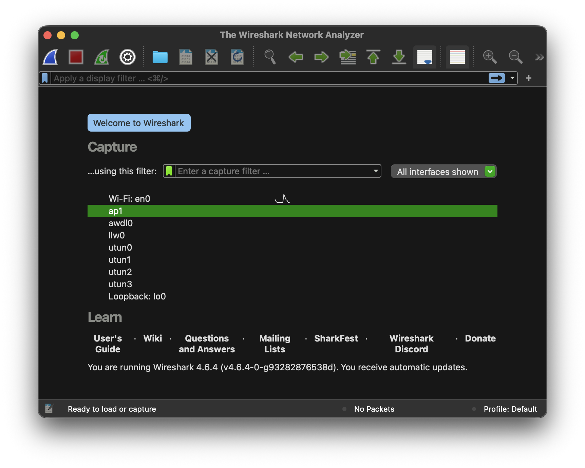

## Navigace v UI

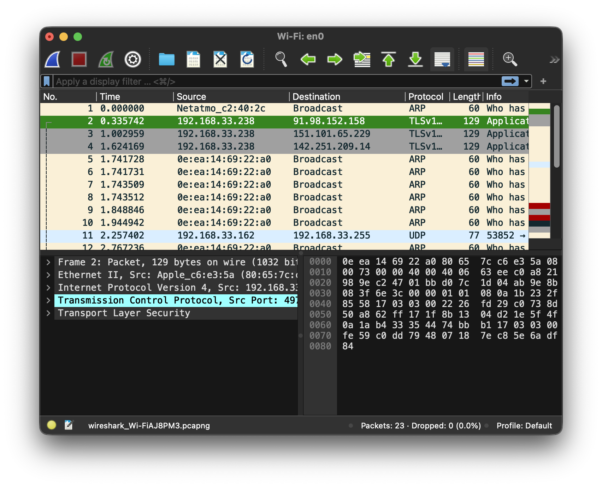

### Packet list

Paket na každý řádek

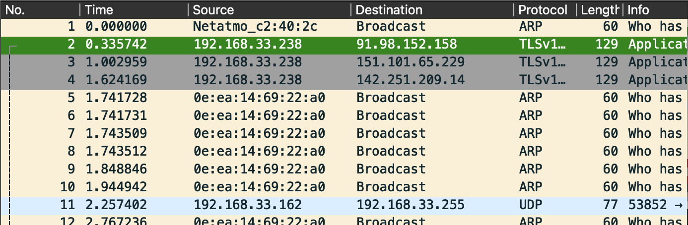

|**Sloupec**|No.|Time|Source|Destination|Protocol|Length|Info|
|-------|---|----|------|-----------|--------|------|----|
|**Výzmnam**|Číslo paketu|Čas zachycení|Zdrojová IP|Cílová IP|ARP/TCP/UDP/...|Délka paketu (v bytech)|Inforamce o paketu|

### Packet detail

Každý řádek představuje vrstvu
- Rozbalovací struktura

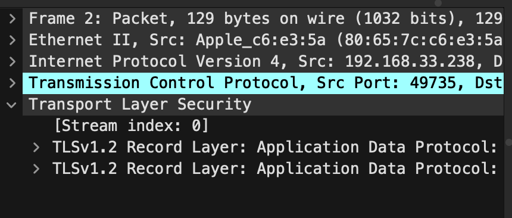

### Packet bytes

Data packetu rozepsaná v hexu

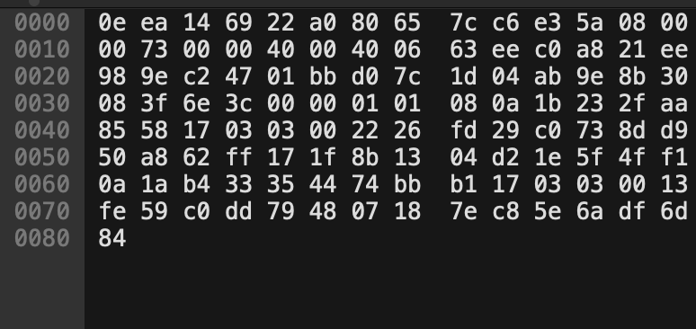

### Základní ovládání
#### **Start capture**
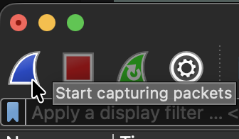

#### **Stop capture**
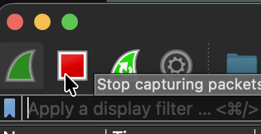

#### **Capture filters**

Do horního pole:
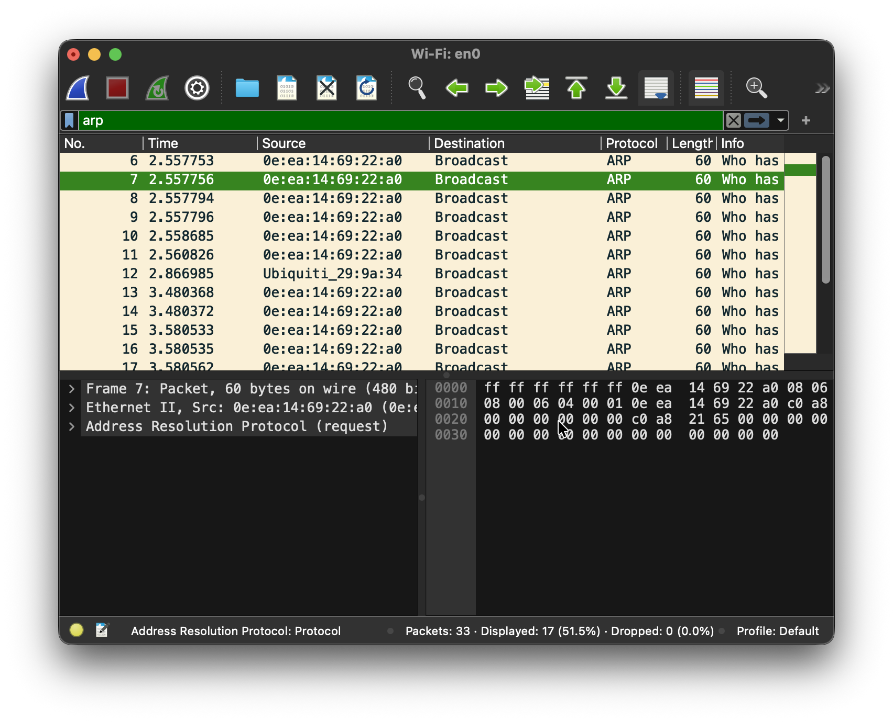

Struktura
|Pole|Operátor|hodnota|Logický op.| ...|
|----|--------|-------|----------|----|
|`tcp.addr`|`==`|`192.168.1.1`|and|~~další operace~~|
|`tcp.port`|`!=`|`443`|or|`arp`|

- Podle IP: `ip.addr == 192.168.1.1`
- Podle portu (tcp): `tcp.port == 443`
- Podle protokolu: `http`, `arp`, ...
- Velikost paketu: `frame.len > 1000`
- Podle properties: `tcp.flags.syn == 1` (pouze TCP SYN pakety)
- Vyhledávání textu: `frame contains "password"`

Specifická pole:
- `ip`
  - `ip.src`: Zdrojová adresa
  - `ip.dst`: Cílová adresa
  - `ip.addr`: Buď cílová nebo zdrojová adresa

## Analýza komunikace
### Follow stream

Sestavit data od klienta (červeně) a od serveru (modře)

1. Vybrat paket
2. Prvý klik
3. "Follow stream"
    - `tcp`, `udp`, `http`, ...

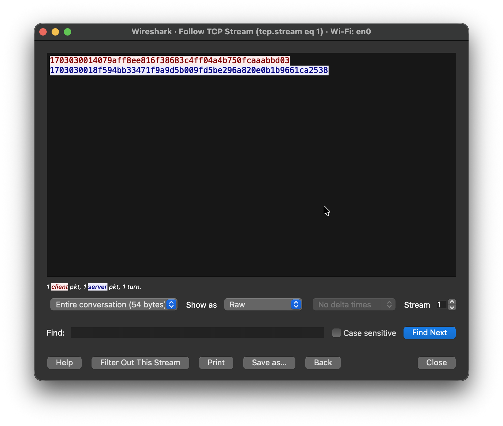
- Data jsou zašifrována

### Rekonstrukce dat

Uložit původní data streamu -> např. přenesený obrázek

Omezení: pouze nešifrovaný provoz

V Okně "Follow tcp stream":
1. Tlačítko `save as`
    - Výběr "Show as" umožňuje vybrat typ dat, které cheme uložit/zobrazit
      - `raw`, `c array`, etc.

## Pokročilé funkce

### Statistiky

#### **Hierarchie protokolů**

**KDE?**: Menubar -> `Statistics` -> `Protocol hierarchy`

**CO?**
- Zastoupení jednotlivých protokolů v zachyceném trafficu
  - A dalších pár informací :D

**PROČ?**
- Rychlý předhled co se děje v síti
  - Identifikace problémů nebo podezřelého chování
    - Např. `70 % TCP` → běžný web, ale `20 % DNS` → může být podezřelé (např. tunneling)

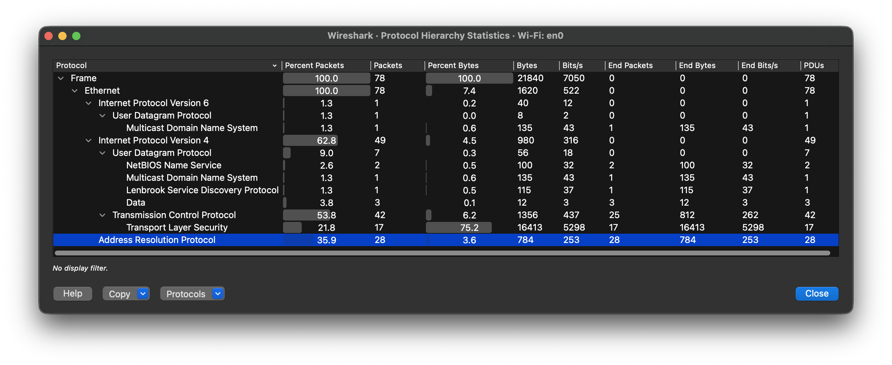

#### **Endpoints**

**KDE?**: Menubar -> `Statistics` -> `Endpoint`

**CO?**
- Seznam IP (a MAC) adres a jejich počty odeslaný, přijatých paketů
  - \+ Objem dat

**PROČ?**
- Nejaktivnější zařízení: "Top talkers"
- Podezřelé IP

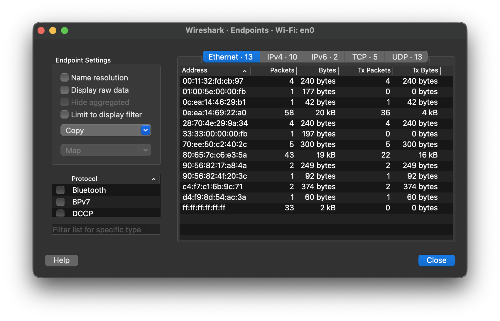

#### **Export objeků**

**KDE?**: Manubar -> `File` -> `Export Objects` -> Volitelný formát

**CO?**
- Wireshark vytáhne soubory z komunikace

**PROČ?**
- Forenzní analýza (co bylo přeneseno)
- Malware analýza

#### **RTT, latence**

**KDE?**: Menubar -> `Statistics` -> `TCP Stream Graphs` -> `Round Trip Time`
- Nebo filtr `tcp.analysis.ack_rtt`

**CO?**
- Latence spojení

### Analýza protokolů

#### **HTTP**

Filtr: `http`

**Co analyzovat**:
- **Requesty**: `GET /index.html`, `POST /login`
- **Hlavičky**: Host, User-Agent, Cookie
- **Data**: Formuláře (login, hesla), odpovědi API

#### **HTTPS**

Filtr: `tls`

**CO?**
- SNI (Server Name Indication)
- Certifikát serveru
- Handshake

#### **[DNS](./03%20-%20počítačové%20sítě.md#dns-domain-name-service)**

Filtr: `dns`
- Nebo `dns.qry.name == "example.com"`

**CO?**
- Dotazy: `A`, `AAAA`, `MX`, `TXT`
- Odpovědi: IP adresy

#### **[DHCP](./03%20-%20počítačové%20sítě.md#dhcp-dynamic-host-configuration-protocol)**

Filtr: `dhcp`

**CO?**
- Přidělená IP
- MAC adresa klienta
- DHCP server

#### **ARP**

Filtr: `arp`

**CO?**
- Duplicitní odpovědi - arp spoofing

#### **TCP Handshake**

Filtr: `tcp.flags.syn == 1 or tcp.flags.ack == 1`

**CO?**
- Jestli handshake proběhne správně
- Zpoždění mezi pakety (latence)
- Neúspěšná spojení

---

# Praktická analýza

## Packet Loss

- [Vysvětlení](./04%20-%20průzkum%20a%20diagnostika%20sítě.md#packet-loss)

#### **Typické příčiny**
- Přetížená síť
- Vadný kabel / Wi-Fi signál
- Chyby na routeru

## Retransmission

Když paket nedorazí, protokol (např. TCP) ho pošle znovu.
- Wireshark filtr: `tcp.analysis.retransmission`

#### **Typické příčiny**
- Nestabilní spojení
- Přetížení linky
- Špatná kvalita Wi-Fi

#### **Jak se projevuje**
- Zpomalení komunikace
- Zvýšené zatížení sítě

#### **Co sledovat**
- Vysoký počet retransmisí = problém v síti
- Často souvisí se ztrátou paketů

## Latence

Doba, za kterou paket dorazí z bodu `A` do bodu `B`.

#### **Jak se projevuje**
- Lag ve hrách
- Zpožděné reakce webu
- Sekání videohovorů

#### **Jak ji zjistit**
- `ping`: sleduj hodnotu v ms
- `traceroute`: kde vzniká zpoždění

#### **Orientačně**
- `0`–`20` ms: Výborně
- `20`–`50` ms: 👍
- `100`+ ms: no bueno

## Pomalé připojení

#### **Jak se projevuje**
- Dlouhé načítání stránek
- Pomalé stahování
- Buffering videí

#### **Co sledovat**
- Download / Upload rychlost
- Kolísání rychlosti

#### **Typické příčiny**
- Přetížení sítě
- Omezení ISP

## Postup analýzy

1. Otestuj základ (`ping`)
    - Zkontroluj latenci a packet loss
2. Změř rychlost
    - Porovnej s tím, co máš mít od ISP
3. Sleduj trasu (`traceroute`)
    - Najdi, kde se problém objevuje
4. Zachyť provoz (`Wireshark`)
    - Hledej retransmise, chyby TCP
5. Izoluj problém
    - Wi-Fi vs. kabel
    - Lokální síť vs. internet

---

# Bezpečnostní analýza
## Detekce nebezpečného provozu

### Co je podezřelé
- Neobvyklé IP adresy (např. zahraniční servery bez důvodu)
- Neznámé porty nebo protokoly
- Náhlý nárůst provozu (spikes)
- Komunikace v noci / mimo běžnou dobu
- Šifrovaný provoz na neobvyklých portech

#### **Analýza**
Wireshark - Podezřelé domény, podezřelé porty, systémové logy, atd.

## Identifikace síťových útoků

### DDos (**D**istributed **D**enial **of** **S**ervice)
Extrémní množství požadavků -> přetížení serveru

#### **Jak poznat**
- Velké množství spojení z různých IP
- SYN flood (TCP bez dokončení handshake)

### Port scanning - `nmap`

Útočník hledá otevřené porty

#### **Jak poznat**
- Jedna IP testuje mnoho portů rychle za sebou

Wireshark filtr: `tcp.flags.syn == 1 && tcp.flags.ack == 0`

### Man in the middle (MITM)

Útočník odposlouchává komunikaci

#### **Jak poznat**
- Duplicitní/nečekané odpovědi ARP
- Duplicitní MAC adresy

### Brute-force

Opakované pokusy o přihlášení

#### **Jak poznat**
- Mnoho login requestů za krátký čas

### Další nástroje pro detekci

- [Snort](https://www.snort.org/) - 🐷
- [Suricata](https://suricata.io/) - Observe. Protect. Adapt.

## Analýza malware komunikace

Cíl: Jak se malware chová v síti

Co malware typicky dělá:
- Kontaktuje centrální server
  - Něco jako řídící středisko daného malwaru
- Stahuje další payload
- Odesílá data ven (exfiltrace)
- Používá šifrování nebo obfuskaci

### Co sledovat
- Náhodně vygenerované domény
  - `.xyz`, `.top`
- HTTP(s): Podezřelé URL nebo User-Agent
- Velikost a frekvence paketů
  - Malé pravidelné pakety - beaconing
  - Velké odchozí přenosy - možný únik dat

### Nástroje
- Wireshark
- [Zeek](https://zeek.org/) - Monitorování sítí
- [VirusTotal](https://www.virustotal.com/gui/home/upload) - Testování malwaru, domén, atd.

## Optimalizace sítě:

### Analýza využití bandwidth

**bandwith** = maximální kapacita připojení/využití

#### **Co sledovat**
- Celkový provoz (download / upload)
- Která zařízení spotřebovávají nejvíc dat
- Jaké aplikace/protokoly (např. video, hry, cloud)

#### **Příznaky problému**
- Linka je často na 90–100 % využití
- Náhlé špičky (např. zálohování, streamování)
- Jeden uživatel „zahltí“ síť

#### **Optimalizace**
- Omezení bandwidth pro některé aplikace
- Upgrade linky (pokud je trvale přetížená)

### Identifikace bottlenecků

**Bottleneck** = místo, kde se provoz zpomaluje
- Router
- Switch
- Server
- Wi-Fi

#### **Jak bottleneck najít**
1. **Postupné testování** - izolace
    - Testovat jednotlivé části sítě
      - PC -> Router (OK?)
      - Router -> Internet (OK?)
2. **Latence a `traceroute`**
    - Sledovat, kde skokově roste latence
3. **Využití jednotlivých zařízení**
    - Např. CPU routeru často na 100%
4. **Analýza ve `wireshark`**
    - [Retransmise](#retransmission)
    - Zpoždění TCP (TCP delays)
    - Duplicitní ACK

#### **Typické bottlenecky**
Wi-Fi - Slabý signál, rušení, příliš mnoho zařízení

Nedostatečný provoz od ISP/operátora

Síťová zařízení - Starý router, špatná konfigurace

